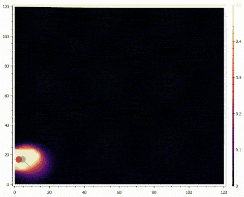

# PointProcessDecoder

This repo contains a C# implementation of the state-space point process neural decoder inspired by the [replay_trajectory_classification model](https://github.com/Eden-Kramer-Lab/replay_trajectory_classification). The code uses the [TorchSharp library](https://github.com/dotnet/TorchSharp), a .NET/C# wrapper around the torch library. It provides a flexible framework for performing neural decoding of observations from spike-train or clusterless mark data based on point processes and state-space models.

## Overview

The goal of this software is to perform neural decoding. In particular, this package provides a framework to encode latent states based on neural activity and subsequently perform decoding. Sorted spike data are modelled as point processes while clusterless spike events are modelled as marked point processes. Neural data sources are modelled as Poisson emissions within the state-space model.

## Demos

### Decoding from Hippocampal Sorted Units

Below is a demo running online decoding of position with spike sorted data from tetrode recordings of mouse hippocampal neurons.

<p align="center">

</p>

*This demo shows online decoding of the hippocampus. A mouse is placed into a W-shaped maze and allowed to freely explore. Neural spikes from hippocampal units are combined with the animals position and used to update the encoder. Given small batches of previously unseen neural spiking data, the model can decode the animals position from a posterior distribution over the latent space. The green dot shows the true position of the animal in the arena and the red data shows the predicted position, taken as the maximum a posteriori estimate of the posterior distribution. The original data for this demo was published in Eric L Denovellis, Anna K Gillespie, Michael E Coulter, Marielena Sosa, Jason E Chung, Uri T Eden, Loren M Frank (2021) Hippocampal replay of experience at real-world speeds eLife 10:e64505.*

### Decoding from Striatal Sorted Units

Below is a demo running online decoding with spike sorted data from neuropixel recordings of mouse striatum.

<p align="center">

</p>

*This demo shows online decoding of the striatum. A mouse is trained to press buttons in a correct sequence to receive a reward. Spiking activity from striatal units are fed into the encoder along with the animal's head position. The decoder outputs a posterior distribution over position given small batches of neural spiking data it has not learned from. The green dot shows the true position of the animal's head in the arena and the red data shows the maximum a posteriori estimate of the posterior distribution. The original data for this demo came from Emmett J thompson, Lars Rollik, Benjamin Waked, Georgina Mills, Jasvin Kaur, Ben Geva, Rodrigo Carrasco-Davis, Tom George, Clementine Domine, William Dorrell, Marcus Stephenson-Jones (2024) Replay of procedural experience is independent of the hippocampus bioRxiv.*


### Classifying Replay Activity in Synthetic Data

Below is a demo showing simultaneous decoding and classification of replay activity in synthetic data derived from sorted units in mouse striatum.

<p align="center">

</p>

*This demo shows online decoding and classification of replay activity in synthetic data derived from the striatum. First, the model was trained on 80% of data for a single session (training data). For the remaining 20% of data (testing data), the neuron IDs were shuffled to create a mismatch of the model's encoded receptive fields while preserving the temporal structure within each unit. Unchanged neural activity during periods of the testing data where the animal performed a correct sequence were randomly inserted into different timepoints of the synthetic data. The trained classifier decodes the latent position online from the synthetic neural activity and classifies the dynamics of the latent variable. A simple logistic regression model is then used to classify the discrete state probabilities provided by the classifier to predict at each timepoint whether the data being decoded were inserted, which we call synthetic "replay" events. The original data for this demo came from Emmett J thompson, Lars Rollik, Benjamin Waked, Georgina Mills, Jasvin Kaur, Ben Geva, Rodrigo Carrasco-Davis, Tom George, Clementine Domine, William Dorrell, Marcus Stephenson-Jones (2024) Replay of procedural experience is independent of the hippocampus bioRxiv.*

## Description

There are 3 main components of the model: encoder, likelihood, and decoder.

### Decoder

Currently, the software supports the `StateSpaceDecoder` and the `HybridStateSpaceClassifier`. 

#### State-Space Decoder

The `StateSpaceDecoder` implements a state-space decoding model. The state-space decoder postulates that, given the initial conditions $p(x_0)$, the posterior probability $p(x_t | O_{1:t})$ at each time step $t$ can be calculated iteratively using:

$$
p(x_t | O_{1:t}) \propto \int p(O_t | x_t) p(x_t | x_{t-1}) p(x_{t-1} | O_{1:t-1}) dx_{t-1}
$$

We need to specify the initial conditions, $p(x_0)$, the transitions or state-space dynamics, $p(x_t | x_{t-1})$, and the likelihood function, $p(O_t | x_t)$.

For the initial conditions, $p(x_0)$, the package currently supports defining a `DiscreteUniform`, in which all possible states are equally likely to occur. In this configuration, the state-space is bounded by minimum and maximum values for each dimension of our data and gets partitioned into discrete bins based on the number of steps along each dimension. Users must supply values for the `minStateSpace`, `maxStateSpace`, and `stepsStateSpace`, which can be uniquely specified for each dimension. The length of each array corresponds to the number of state-space dimension, and all of them must match the user specified `stateSpaceDimensions` parameter.

For the transitions, $p(x_t | x_{t-1})$, we can specify how the latent variable evolves over time. The software currently supports `Uniform`, where the latent variable has equal probability of transitioning to any other point in the state-space, or `RandomWalk`, where the transitions are constrained by a multivariate normal distribution such that adjacent positions in the state-space are more likely to occur. The variance of `RandomWalk` can be specified with the `sigmaRandomWalk` parameter that determines the variance of the movement in all dimensions.

#### Hybrid State-Space Classifier

The hybrid state-space classifier is similar to the decoder but extends it in one particular way. The classifier computes the following posterior probability $p(x_t, I_t | O_{1:t})$ which includes both a prediction of the latent variable $x$ and of the state variable $I$ at time $t$. Currently, the `HybridStateSpaceClassifier` has 3 discrete states which refer to the dynamics of the latent variable, and are interpreted as stationary, continuous, and fragmented.  

$$
p(x_t, I_t | O_{1:t}) \propto p(O_t | x_t, I_t) \sum_{I_{k-1}} \int p(x_t | x_{t-1}, I_t, I_{t-1}) Pr(I_t | I_{t-1}) p(x_{t-1}, I_{t-1} | O_{1:t-1}) dx_{t-1}
$$

In addition to supplying the initial conditions $p(x_0, I_0)$, we also supply the discrete transitions $Pr(I_t | I_{t-1})$ and the continuous transitions $p(x_t | x_{t-1}, I_t, I_{t-1})$. For the initial conditions, again we use the `DiscreteUniform` class and set all points in our state-space as equally probable. Next, the discrete transitions are set by passing in the `stayProbability` parameter, which sets the value along the diagonal of the discrete transitions matrix $Pr(I_t | I_{t-1})$, and remaining values being set to (1 - `stayProbability`) / 2. The continuous transitions matrix, $p(x_t | x_{t-1}, I_t, I_{t-1})$, describes the evolution of the latent variable as it relates to each discrete state. When the latent dynamics are in the fragmented state, the continuous dynamics are uniform across the state-space, meaning every point in the state-space is equally probable. When the state is continuous, the dynamics evolve according to a random walk. For the stationary state, the position within the state-space remains unchanged over time.

### Likelihood

For the likelihood measure, $p(O_t | x_t)$, the method selected will depend on the type of encoder. There are currently 2 types of likelihoods: `Poisson` and `Clusterless`. 

#### Poisson Likelihood

The `Poisson` likelihood is used in conjunction with the `SortedSpikes` encoder and performs the following calculation:

$$
p(O_t | x_t) = p( \Delta N ^{1:U} _{t} | x_t) \propto \prod ^U _{i=1} [ \lambda _i (t | x_t) \Delta _t] ^{\Delta N ^i _{t}} exp[ - \lambda _i (t | x_t) \Delta _t]
$$

Here, $N^i_{t}$ represents whether unit $i$ has produced a spike/event at time $t$ within the $\Delta_t$ time window. For the purposes of this software, $\Delta_t = 1$. The conditional intensity, $\lambda_i(t | x_t)$, represents the instantaneous rate of events of unit $i$ given the observations of the latent variable $x$ at time $t$.

#### Clusterless Likelihood

The `Clusterless` likelihood method is used in conjunction with the `ClusterlessMarks` encoder and performs the following computation:

$$
p(O_t | x_t) = p( \Delta N ^{1:C} _t, \vec{m} ^c _{t,j}) \propto \prod ^C _{c=1} \prod ^{\Delta N ^C _t} _{j=1} [ \lambda _c (t, \vec{m} ^c _{t,j} | x_t) \Delta _t ] exp [ - \Lambda _c (t | x_t) \Delta _t]
$$

Here, $N_{t}^{1:C}$ represents whether a mark was detected on channel $c$, and $\vec{m}^c_{t,j}$ represents the marks $\vec{m}$ detected on channel $c$ at time $t$ with marks detected through times $j$. The `Clusterless` likelihood consists of two separate conditional intensity functions. The conditional intensity $\lambda_c(t, \vec{m}^c_{t,j} | x_t)$ represents the firing rate of unique sets of marks $\vec{m}$ on channel $c$, whereas $\Lambda_c(t | x_t)$ represents the rate at which all events occur on channel $c$.

### Encoder

The encoder is used to calculate the conditional intensity functions, the rate of events occurring with respect to the latent variable. There are two types of encoders currently supported: `SortedSpikes` and `ClusterlessMarks`

#### Sorted Spike Encoder

In the case of the `SortedSpikes` encoder, the conditional intensity function for each sorted unit takes the form:

$$
\lambda_i(t | x_t) = \mu_i \frac{p_i(x_t)}{\pi(x)}
$$

Where $\mu$ is the mean firing rate, $p(x_t)$ is the distribution of latent observations only when spikes are observed for unit $i$, and $\pi(x)$ is the full distribution of the latent observation. When using the `SortedSpikes` encoder, the user must specify the `numUnits` parameter to allocates the appropriate number of unit estimators at runtime. 

#### Clusterless Marks Encoder

For the `ClusterlessMarks` encoder, we use a marked point process procedure where each spike/event has an associated feature vector or set of marks. In general, marks can be anything associated with a spike event (i.e. spike width, maximum amplitude, etc). The mark conditional intensity function is:

$$
\lambda_c(t, \vec{m}^c_{t,j} | x_t) = \mu_c \frac{p_c(x_t,\vec{m}^c_{t,j})}{\pi(x)}
$$

Where $p_c(x_t,\vec{m}^c_{t,j})$ is the joint probability distribution of the latent state observations $x_t$ observed for unique sets of marks $\vec{m}$ on recording channel $c$. 

Next, we define the channel conditional intensity function as:

$$
\Lambda_c(t | x_t) = \mu_c \frac{p_c(x_t)}{\pi(x)}
$$

Where $p_c(x_t)$ represents the marginal distribution over the latent state across all events observed on recording channel $c$. When using the `ClusterlessMarks` encoder, users must specify the `markDimensions` and `numChannels` parameters which define the number of mark features associated with each spike event and the number of recording channels, respectively.

### Density Estimation

We approximate the probability distributions $p_c(x_t,\vec{m}^c_{t,j})$, $p_c(x_t)$, $p_i(x_t)$, and $\pi(x)$, using methods for kernel density estimation. The package provides 2 methods for estimation: `KernelDensity` and `KernelCompression`. 

#### Kernel Density

The `KernelDensity` estimation method can be formalized as follows:

$$
p(x) = \frac{1}{N} \sum ^{N} _{i=1} \frac{1}{ \sqrt{ (2 \pi) ^d \prod ^d _{j=1} h _j }} exp \left( -\frac{1}{2} \left( \frac{X _i - x}{h _d} \right) ^T \left( \frac{X _i - x}{h _d} \right) \right)
$$

The probability distribution $p(x)$ can be calculated by taking a given set of points $X_i = {X_1, \dots, X_N}$ with dimensionality $D$ and evaluating them over a normal distribution associated with the datapoints $x$ observed during the encoding procedure. The kernel bandwidth parameter, $h$, describes the variance of the Gaussian at dimension $d$. The `KernelDensity` method is more accurate compared to the `KernelCompression` method, but requires more memory and computation time as the number of observations increases.

#### Kernel Compression

At the cost of a small amount of accuracy, the `KernelCompression` estimation method is faster than the `KernelDensity` method with greater observations and requires less memory. It works by computing a Gaussian mixture model to represent $p(x)$ with fewer kernels. Thus, the distribution, $p(x)$, takes the following form:

$$
p(x) = \sum^C_{i=1}w_i\phi_i(x)
$$

Where each kernel component $i$ contributes a probability density, $\phi$, with some weight $w$. Again, the density, $\phi$, is taken as a Gaussian kernel of the same form above.

#### Kernel Merging Procedure

The `KernelCompression` algorithm uses a kernel merging procedure to determine whether the observed data point should lead to the creation of a new kernel component or whether the data point should be used to update the parameters of the closest existing kernel. First, the Mahalanobis distance is calculated between existing kernels and the new data point. The distance is evaluated against the user specified `distanceThreshold` parameter, such that if the distance to the closest kernel is greater than the `distanceThreshold`, then the data point is used to create a new kernel. If the distance is less than this, the closest kernel is updated using a moment matching method. The new weight of the component is updated as follows:

$$
w = w_1 + w_2
$$

And the new $\mu$ of the component becomes:

$$
\mu = w ^{-1} (w _1 \mu _1 + w _2 \mu _2)
$$

Since only the diagonal of the covariance matrix is used in the kernel density estimate, we only update the diagonal elements of the matrix using:

$$
h = w ^{-1} \sum ^2 _{i=1} (h _i + \mu ^2 _i) - \mu ^2
$$

#### Bandwidth Selection

Users of the package must specify the bandwidth parameters used for density estimation. For the distribution, $\pi(x)$, users set the `covariateBandwidth` parameter, where a unique bandwidth can be set for each dimension. Again, the length of this array must be equal to the number of `stateSpaceDimensions` defined above. For both the `SortedSpikeEncoder` and `ClusterlessMarkEncoder`, the `covariateBandwidth` parameter is used to compute the distributions $p_i(x_t)$ and $p_c(x_t)$, respectively. The `ClusterlessMarkEncoder` also takes the `markBandwidth` parameter which is used for calculating the distribution, $p_c(x_t,\vec{m}^c_{t,j})$. A unique bandwidth can be specified for each mark feature so long as the length of the array is equal to the `markDimensions` parameter.

## Steps to Build

1. Install the .NET SDK:
Download [the .NET SDK](https://dotnet.microsoft.com/download) if you haven't already.

2. Clone the repository:

```bash
git clone https://github.com/ncguilbeault/PointProcessDecoder.git
cd PointProcessDecoder
```

3. Restore dependencies:

```bash
dotnet restore
```

4. Build the solution:

```bash
dotnet build
```

## Quickstart

Here is a minimal example of how to use the decoder in a console app:

```csharp
using PointProcessDecoder.Core;
using PointProcessDecoder.Plot;
using PointProcessDecoder.Simulation;

namespace DecoderDemo
{
    class Program
    {
        static void Main(string[] args)
        {
            // 1. Load data.
            // Example: Generate simulated data
            (position, spikeCounts) = Simulation.Utilities.InitializeSimulation1D(
                numNeurons: 40,
                placeFieldRadius: 0.8,
                firingThreshold: 0.2
            );

            // 2. Create the model and select parameters.
            var model = new PointProcessModel(
                estimationMethod: Core.Estimation.EstimationMethod.KernelDensity,
                transitionsType: Core.Transitions.TransitionsType.Uniform,
                encoderType: Core.Encoder.EncoderType.SortedSpike,
                decoderType: Core.Decoder.DecoderType.StateSpaceDecoder,
                stateSpaceType: Core.StateSpace.StateSpaceType.DiscreteUniform,
                likelihoodType: Core.Likelihood.LikelihoodType.Poisson,
                minStateSpace: [0],
                maxStateSpace: [120],
                stepsStateSpace: [50],
                observationBandwidth: [5],
                stateSpaceDimensions: 1,
                nUnits: 40
            );

            // 4. Encode neural data and observations
            model.Encode(spikeCounts, position);

            // 5. Predict or decode observations from spikes
            var prediction = model.Decode(spikeCounts);

            // 6. Display results
            Heatmap plotPrediction = new(
                xMin: 0,
                xMax: steps * cycles,
                yMin: 0,
                yMax: 120,
                title: "Prediction"
            );

            plotPrediction.Show<float>(
                prediction
            );

            plotPrediction.Save(png: true);
        }
    }
}
```

## References

This work is based on several previously published works. If you use this software, consider citing the following:

1. Denovellis, E. L., Gillespie, A. K., Coulter, M. E., Sosa, M., Chung, J. E., Eden, U. T., & Frank, L. M. (2021). Hippocampal replay of experience at real-world speeds. Elife, 10, e64505.

2. Sodkomkham, D., Ciliberti, D., Wilson, M. A., Fukui, K. I., Moriyama, K., Numao, M., & Kloosterman, F. (2016). Kernel density compression for real-time Bayesian encoding/decoding of unsorted hippocampal spikes. Knowledge-Based Systems, 94, 1-12.


**Contributions and feedback are welcome!**
